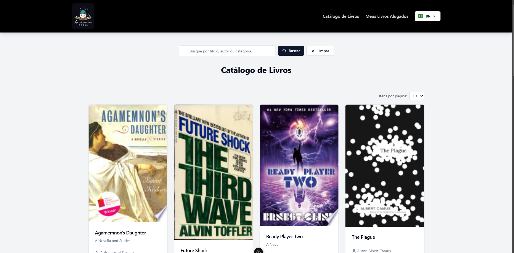

# 📚 Snowman Books

<p align="center">
  
</p>

**Snowman Books** é um projeto desenvolvido como parte de um teste técnico para a **Snowlabs**. Este site moderno e funcional foi criado para oferecer uma experiência completa de aluguel de livros, utilizando a integração com a API do Google Books para garantir uma experiência realista e escalável.

Os usuários podem:

- Navegar pelos livros disponíveis.
- Selecionar os livros que desejam alugar.
- Buscar livros por título ou autor.
- Visualizar os livros já alugados.
- Mudar a lingua do site para inglês ou português.

Além disso, todo o gerenciamento de estado é feito com o **Pinia**, sincronizado com o **local storage**. Isso assegura que, mesmo ao atualizar a página, os dados do usuário permanecem intactos, proporcionando uma melhor experiência. 🚀

## 🚀 Funcionalidades

- 🔍 **Busca por livros**: Integração com a API do Google Books para buscas em tempo real.
- 📚 **Seleção de livros**: Interface intuitiva para escolher os livros para aluguel.
- 🗂️ **Gerenciamento de aluguéis**: Visualização simples e prática dos livros já alugados.
- 📱 **Design responsivo**: Interface adaptada para qualquer dispositivo.
- 🔒 **Persistência de dados**: Informações armazenadas no **local storage** usando Pinia, garantindo que os dados não sejam perdidos mesmo após o recarregamento da página.

---

## 🛠️ Tecnologias Utilizadas

O projeto foi desenvolvido utilizando ferramentas modernas e robustas para garantir qualidade, desempenho e facilidade de manutenção:

### **Frontend**

- 🖥️ **[Nuxt 3](https://nuxt.com/)**: Framework Vue para aplicações de alto desempenho.
- 🖌️ **[Vue.js](https://vuejs.org/)**: Biblioteca JavaScript para construção de interfaces dinâmicas.
- 🗂️ **[Pinia](https://pinia.vuejs.org/)**: Gerenciamento de estado simples e poderoso.
- 🎨 **[Tailwind CSS](https://tailwindcss.com/)**: Framework CSS utilitário para estilização rápida e consistente.
- 🧩 **[Radix Vue](https://radix-vue.com/)**: Componentes acessíveis e estilizados para uma experiência de usuário aprimorada.
- ✨ **[Lucide Icons](https://lucide.dev/)**: Conjunto de ícones modernos e personalizáveis.

### **Integração e APIs**

- 📚 **[Google Books API](https://developers.google.com/books)**: Fonte de dados em tempo real para informações de livros.

### **Testes e Qualidade**

- 🧪 **[Vitest](https://vitest.dev/)**: Framework de testes moderno e rápido.
- 🛠️ **[Testing Library](https://testing-library.com/)**: Ferramenta para testes baseados em interação do usuário.
- 📖 **[Storybook](https://storybook.js.org/)**: Documentação visual para componentes UI.

### **DevOps e Build**

- ⚡ **[Vite](https://vitejs.dev/)**: Ferramenta para bundling e desenvolvimento rápido.
- 🛡️ **[TypeScript](https://www.typescriptlang.org/)**: Tipagem estática para maior confiabilidade no código.

---

## 🔧 Como Instalar e Rodar o Projeto

### **Pré-requisitos**

Certifique-se de ter instalado:

- **Node.js** (v18 ou superior)
- **NPM** ou **Yarn**

### **Passos para Instalação**

1. Clone o repositório:

   ```bash
   git clone https://github.com/seu-usuario/snowman-books.git
   cd snowman-books
   ```

2. Instale as dependências:

   ```bash
   npm install
   # ou
   yarn install
   ```

3. Configure as variáveis de ambiente:

   - Crie um arquivo `.env` na raiz do projeto e configure a API Key do Google Books:
     ```env
     GOOGLE_BOOKS_API_KEY=your_api_key_here
     ```

4. Inicie o servidor de desenvolvimento:

   ```bash
   npm run dev
   # ou
   yarn dev
   ```

5. Acesse o site no navegador:
   - `http://localhost:3000`

---

## 📂 Estrutura do Projeto

```plaintext
snowman-books/
├── assets/          # Estilos globais e assets estáticos
│   ├── css/         # Estilos em Tailwind CSS
│   ├── flags/       # Bandeiras para seleção de idioma
│   ├── img/         # Imagens estáticas, incluindo métodos de pagamento
│   └── logo-snow.png
├── components/      # Componentes reutilizáveis
│   ├── books/       # Componentes relacionados a livros
│   ├── pagination/  # Componentes de paginação
│   ├── rental/      # Componentes para o fluxo de aluguel
│   ├── layout/      # Componentes de layout como cabeçalhos
│   └── ui/          # Componentes de UI (botões, cartões, etc.)
├── composables/     # Funções reutilizáveis
├── locales/         # Arquivos de tradução para i18n
├── pages/           # Páginas da aplicação
├── public/          # Arquivos estáticos públicos
├── services/        # Lógica de comunicação com APIs
├── stores/          # Gerenciamento de estado com Pinia
├── test/            # Testes unitários e de integração
├── types/           # Definições de tipos TypeScript
├── .storybook/      # Configuração do Storybook
├── nuxt.config.ts   # Configuração principal do Nuxt
└── package.json     # Dependências e scripts do projeto
```

---

## 🚦 Scripts Disponíveis

- **`npm run dev`**: Inicia o servidor de desenvolvimento.
- **`npm run build`**: Compila a aplicação para produção.
- **`npm run generate`**: Gera arquivos estáticos para deploy.
- **`npm run test`**: Executa testes automatizados.

---

## 🛡️ Testes

Este projeto inclui testes automatizados para garantir funcionalidade e qualidade. Para executar os testes:

```bash
npm run test
```

---

## 🎨 Demonstração Visual

| **Página Inicial**                            | **Detalhes do Livro**                            | **Livros Alugados**                            |
| --------------------------------------------- | ------------------------------------------------ | ---------------------------------------------- |
|  |  |  |

---

## 📜 Licença

Este projeto está sob a licença **MIT**. Veja o arquivo [LICENSE](./LICENSE) para mais informações.
